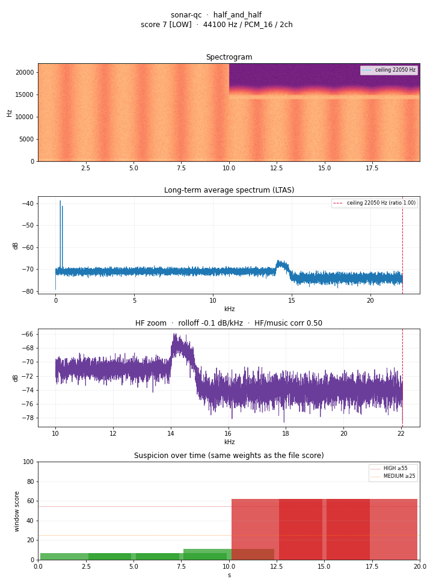

# sonar-qc

[](https://github.com/cryptoleo79/sonar-qc/actions/workflows/ci.yml)
[](https://github.com/cryptoleo79/sonar-qc/releases)
[](LICENSE)
[](pyproject.toml)

**Audio provenance & quality screening for music submissions.**

sonar-qc measures acoustic traits of an audio file and reports a calibrated
**suspicion score** together with the **evidence** behind it.

## What it is / what it is not

**It IS** a spectral provenance and quality screener. It measures measurable
acoustic traits (bandwidth ceiling, HF rolloff, how HF energy tracks the music,
bit-depth padding, stereo HF coherence) and reports a score plus the reasons.

**It IS NOT** an "AI detector." **It cannot prove a track is AI-generated, and it
cannot prove a track is human-made.** It is a *disclosure aid*: it helps a
creator or a platform decide whether a track likely carries
generative-rendering artifacts and therefore warrants disclosure or human
review.

> A HIGH score means measurable generative-rendering artifacts are present — it
> does **not** prove how the track was made, and it must **never** be used as an
> accusation or as sole grounds for a takedown. See
> [docs/LIMITATIONS.md](docs/LIMITATIONS.md).

The moment this tool implies certainty, it is broken. Its entire value is
credibility; overclaiming destroys it.

## Install

Straight from GitHub:

```bash
pip install git+https://github.com/cryptoleo79/sonar-qc.git
```

Or from a clone (for development):

```bash
git clone https://github.com/cryptoleo79/sonar-qc.git
cd sonar-qc
python3 -m venv .venv && source .venv/bin/activate
pip install -e .
```

Python 3.10+. Depends only on numpy, scipy, soundfile, and matplotlib. Both
`sonar-qc <file>` and `python -m sonar_qc <file>` work.

## Quickstart

```bash
sonar-qc track.wav                      # human-readable, evidence listed
sonar-qc track.wav --json               # machine-readable for pipelines
sonar-qc ./folder --batch --csv out.csv # screen a directory to CSV
sonar-qc track.wav --report ./reports   # PNG: spectrogram + LTAS + HF zoom (+timeline)
sonar-qc track.wav --segments           # localize artifacts in time
sonar-qc track.mp3 --assume-lossy       # score without format-confounded bands
```

**Exit codes** (so it can gate a submission pipeline):
`0` LOW · `1` MEDIUM · `2` HIGH · `3` quality REJECT · `4` usage/error.

## Example

A synthetic test track — clean for its first half, hard-walled with a
decorrelated HF bed for its second half (the classic splice case):

```text
LOW    half_and_half.wav   score 7
  no obvious red flags — NOT a guarantee
  evidence:
    +7   HF L/R correlation 1.000 > 0.85 (synthetic tell)
  where (frequency):
    hf_stereo_corr: ≥14 kHz stereo field
  consistent with (hints, not identification):
    [weak] Native full-bandwidth PCM (no ceiling fingerprint)
  ⚠ SEGMENT ESCALATION: file is LOW overall but a window reaches HIGH —
    segment(s) score above the whole-file band; review the flagged windows
  where (time): worst 10.0–15.0s (score 62 HIGH); 43% of windows ≥ MEDIUM
       10.0–15.0   s  score 62  HIGH
       12.5–17.5   s  score 62  HIGH
       15.0–20.0   s  score 62  HIGH
```

The whole-file average masks the walled half (LOW overall) — the sliding
windows and the escalation flag catch it. The `--report` PNG shows the same
story visually: the suspicion timeline flips exactly where the spectrogram
shows the wall appear.



## What each feature measures

| feature | measures | intuition |
|---|---|---|
| `ceiling_hz` / `ceiling_ratio` | bandwidth ceiling vs Nyquist | synthetic renders often stop hard at a fixed frequency |
| `rolloff_db_per_khz` | PSD slope, 15–18 kHz | a steep wall is a hard synthetic edge (**also caused by lossy codecs**) |
| `hf_music_corr` | HF envelope vs music envelope | **the key discriminator** — real air/cymbals track the music; vocoder haze does not |
| `fake_24bit` | 16-bit content padded into a 24/32-bit wrapper | container inflation, a common export tell |
| `hf_stereo_corr` | L/R correlation of HF | near-1.0 HF is synthetic; real HF decorrelates |
| `above_ceiling_level_db` | energy above the ceiling | real noise floor vs digital silence |

Full definitions and rationale: [docs/METHODOLOGY.md](docs/METHODOLOGY.md).

## Where and what-kind (localization & signature hints)

Beyond the whole-file score, sonar-qc reports:

- **Where in frequency** — each contributing factor is mapped to the band its
  evidence lives in (e.g. `hf_music_corr` → ≥14 kHz vs the 200 Hz–8 kHz music
  band), shown in the output and the report's HF panels.
- **Where in time** (`--segments`) — the track is re-scored in 5 s sliding
  windows with the same weights, so a reviewer can jump straight to the worst
  segment. The `--report` PNG gains a suspicion-over-time strip aligned with
  the spectrogram.
- **Segment escalation** — a track that is only *partly* generative can score
  LOW overall because the file-wide average masks the walled segment. When a
  window's band exceeds the file's band, the output flags it explicitly
  (`escalation` in JSON). Exit codes stay tied to the whole-file band; the flag
  is there so pipelines and reviewers can act on it deliberately.
- **What kind of pipeline** — measured features are matched against a visible
  table of known rendering/encoding families (`sonar_qc/signatures.py`):
  generative-render patterns, codec psychoacoustic ceilings, export-pipeline
  tells. **Hints are "consistent with," never identification** — confidence is
  capped at *indicative*, every hint carries its evidence, and codec matches
  describe the encoder, not how the music was made.

## Validation

Observed results from a small, **informal** validation set (not a benchmark;
source files are kept local and not committed):

| Source | Score | Band |
|---|---:|---|
| Raw Suno render (44.1k/24-bit wrapper) | 57 | HIGH |
| Raw Suno render (48k/16-bit) | 59 | HIGH |
| Same track, MP3 | 59 | HIGH |
| Suno render containing a real human vocal | 74 | HIGH |
| Reworked instrument stems (guitar) | 0 | LOW |
| Reworked instrument stems (synth) | 0 | LOW |
| FX/ambient bed | 12 | LOW |

**Interpretive note (non-negotiable).** A HIGH score means generative rendering
was detected — **not** that the creator did no work. In the `74` case a *real
human vocal* was present; it passed through the generative decoder and picked up
the fingerprint. **The tool measures the pipeline, not the person.** It must
never be usable as an accusation.

## Limitations

- **False positives on lossy / lo-fi human recordings.** MP3/AAC impose their own
  bandwidth ceiling and steep rolloff. A genuine human recording that only ever
  existed as a 128 kbps MP3 can trip both bandwidth features. (Measured: one
  track read −6.6 dB/kHz as WAV and −10.8 dB/kHz as MP3.) The CLI flags lossy
  inputs; `--assume-lossy` scores on HF/music correlation and stereo coherence
  only.
- **False negatives on high-quality or heavily reworked generative audio.** A
  render that is resampled, re-recorded through analog, or substantially
  reworked can shed its fingerprints.
- **The fingerprints fade as models improve.** Thresholds need periodic
  recalibration; this is an arms race, not a solved problem.
- **This is a screening aid, never proof.** It must not be the sole basis for an
  accusation or a takedown.

More detail: [docs/LIMITATIONS.md](docs/LIMITATIONS.md).

## Intended uses

- **Pre-submission self-check** — a creator screens their own track so they can
  disclose accurately.
- **Platform intake triage** — route likely-generative submissions to human
  review, not automatic rejection.
- **Research** — measuring how rendering artifacts change across models/time.

## Explicit non-goal

This project **will not** accept contributions aimed at evading detection or
removing fingerprints. Stripping provenance from generated audio to pass it off
as non-generated is the exact harm this tool exists to counter. See
[CONTRIBUTING.md](CONTRIBUTING.md).

## Development

```bash
pip install -e . pytest
pytest -q          # run the test suite (synthetic fixtures, no audio committed)
```

Contributions are welcome within the scope in [CONTRIBUTING.md](CONTRIBUTING.md);
CI runs the suite on Python 3.10–3.12. See [CHANGELOG.md](CHANGELOG.md) for
release history.

## License & attribution

MIT © 2026 Chris Ciari — GitHub: [`cryptoleo79`](https://github.com/cryptoleo79).
See [LICENSE](LICENSE).
